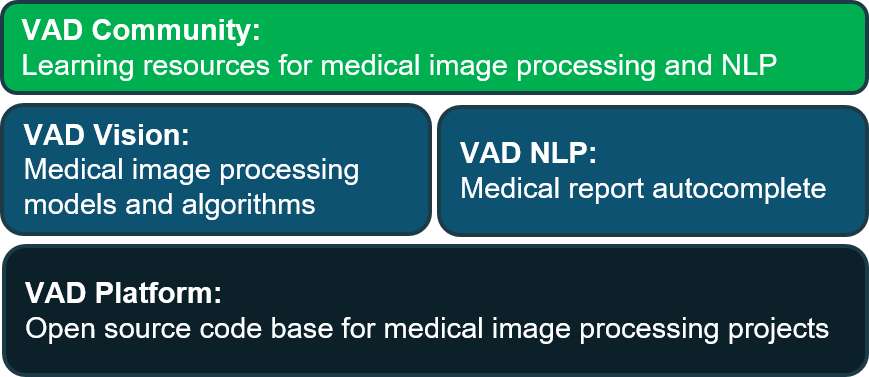

    <h1 style="display: block; font-size: 1.5rem;">VN AIDr - Dự án xử lý ảnh y tế nguồn mở</h1>
    

**VN AIDr** là dự án xử lý ảnh y tế mã nguồn mở xây dựng bởi nhóm **[VNOpenAI](https://vnopenai.org/)**. Chúng tôi xây dựng dự án này trên nền tảng một phần mềm xử lý ảnh y tế nguồn mở (**VAD Platform**). Trên **VAD Platform**, chúng tôi triển khai **VAD Vision** bao gồm các mô hình và các thuật toán xử lý ảnh y tế. Chúng tôi cũng triển khai một mô-đun xử lý ngôn ngữ tự nhiên là **VAD NLP**, với chức năng tự động hoàn thành các báo cáo y tế. Dựa trên nền tảng phần mềm và mô hình phía dưới, chúng tôi xây dựng các tài liệu về xử lý ảnh y tế và xử lý ngôn ngữ tự nhiên nhằm giúp học sinh, sinh viên và những người yêu thích có thể tiếp cận các lĩnh vực này dựa trên các bài toán cụ thể.

## Liên hệ

**Nhóm VNOpenAI**

- **Website:** <https://vnopenai.org/>.
- **Email:** vnopenai@gmail.com.

