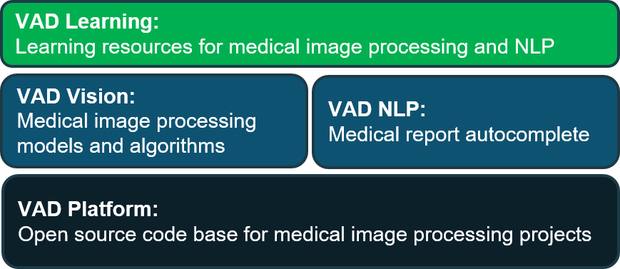

**VN AIDr** là dự án xử lý ảnh y tế mã nguồn mở xây dựng bởi nhóm **[VNOpenAI](https://vnopenai.github.io/)**. Chúng tôi xây dựng dự án này trên nền tảng một phần mềm xử lý ảnh y tế nguồn mở (**VAD Platform**). Trên **VAD Platform**, chúng tôi triển khai **VAD Vision** bao gồm các mô hình và các thuật toán xử lý ảnh y tế. Chúng tôi cũng triển khai một mô-đun xử lý ngôn ngữ tự nhiên là **VAD NLP**, với chức năng tự động hoàn thành các báo cáo y tế. Dựa trên nền tảng phần mềm và mô hình phía dưới, chúng tôi xây dựng các tài liệu về xử lý ảnh y tế và xử lý ngôn ngữ tự nhiên nhằm giúp học sinh, sinh viên và những người yêu thích có thể tiếp cận các lĩnh vực này dựa trên các bài toán cụ thể.

    <!--  -->
    

## Liên hệ

**VNOpenAI** luôn chào đón các đóng góp từ cộng đồng để xây dựng dự án ngày càng hoàn thiện hơn. Đóng góp của các bạn có thể là việc giúp chúng tôi phát triển thêm các chức năng mới, tích hợp mô hình, sửa lỗi phần mềm, hoặc những đánh giá về hiệu năng phần mềm và góp ý về các chức năng cần có từ góc nhìn của các bác sĩ, sinh viên ngành y. Xin vui lòng liên hệ:

**Nhóm VNOpenAI**

- **Website:** <https://vnopenai.github.io/>.
- **Email:** vnopenai@gmail.com.

*\*Hình ảnh được lấy từ slide: [slides/vnopenai-vn-accent.pptx](/slides/vnopenai-vn-accent.pptx)*

