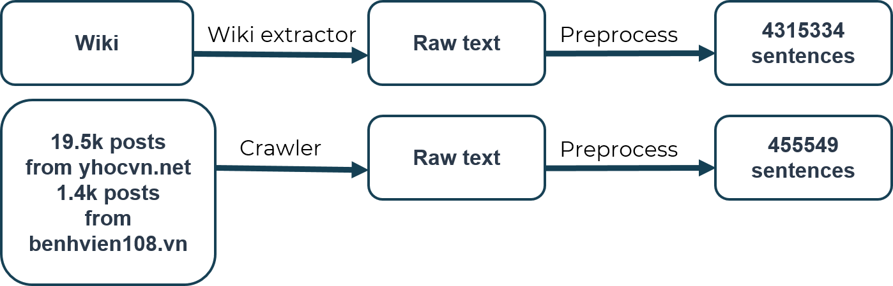
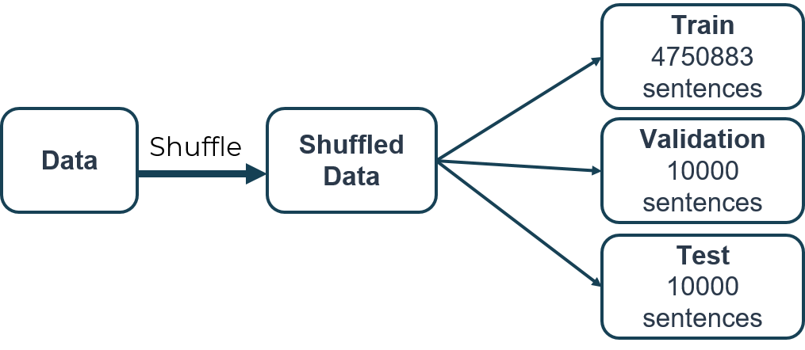

## 1. Thu thập và tiền xử lý dữ liệu

Dữ liệu dùng cho bài toán này được chúng tôi thu thập từ 2 nguồn chính: (1) Wikipedia và (2) dữ liệu bài viết trên [yhocvn.net](https://yhocvn.net/) và [benhvien108.vn](https://benhvien108.vn/).

- **Với Wikipedia:** Dữ liệu được tải về từ [dumps.wikimedia.org](https://dumps.wikimedia.org) và trích xuất văn bản với gói [wikiextractor](https://pypi.org/project/wikiextractor/). Tiếp đó dữ liệu được tiền xử lý và trích xuất được 4315334 câu. Nhằm tiết kiệm thời gian, chúng tôi lấy dữ liệu đã được xử lý sẵn từ [trang này](https://phamdinhkhanh.github.io/2020/05/28/TransformerThemDauTV.html).

- **Với các trang [yhocvn.net](https://yhocvn.net/) và [benhvien108.vn](https://benhvien108.vn/):** Chúng tôi cào được 19.5 nghìn bài viết từ [yhocvn.net](https://yhocvn.net/) và hơn 1400 bài viết từ [benhvien108.vn](https://benhvien108.vn/). Sau khi qua bước tiền xử lý, chúng tôi trích xuất được 455549 câu.

**Các bước tiền xử lý bao gồm:**

- Tách các câu dựa vào các dấu chấm câu.
- Với mỗi câu: loại bỏ các chữ số, dấu câu, các kí tự đặc biệt, chỉ giữ lại các từ tạo nên bởi các chữ cái tiếng Việt và tiếng Anh, ngăn cách chúng bởi 1 dấu cách.
- Chuyển các câu về chữ thường.
- Chuẩn hoá dấu câu: Trong các văn bản tiếng Việt, vị trí chữ cái bỏ dấu có thể không đồng nhất. Ví dụ với chữ "hoà", có văn bản viết "hoà", cũng có văn bản viết là "hòa". Chúng tôi thực hiện đưa vị trí bỏ dấu về một chuẩn chung. Trong trường hợp này, cả "hoà" và "hoà" đều được chuẩn hoá lại thành "hoà".
- Loại bỏ các câu có dưới 10 từ và lớn hơn 200 từ rồi ghi ra tệp văn bản.
- Tạo dữ liệu không dấu bằng cách loại bỏ dấu câu thông qua mã nguồn từ [aivivn.com](https://www.aivivn.com/contests/3).

**Mã nguồn tiền xử lý dữ liệu:** 
- <https://github.com/VNOpenAI/vn-accent/blob/master/preprocess_data/Preprocess_data_Wikipedia.ipynb>.
- <https://github.com/VNOpenAI/vn-accent/blob/master/preprocess_data/Preprocess_data_yhocvn_net_benhvien108_vn.ipynb>.

## 2. Chia dữ liệu

Các dữ liệu từ bước trên, sau quá trình xử lý được gộp vào nhau, trộn ngẫu nhiên và chia thành 3 tập: tập huần luyện (training set) gồm 4750883 câu, tập giám sát (validation set) gồm 10000 câu và tập kiểm thử (test set) gồm 10000 câu.

**Mã nguồn chia dữ liệu:**  <https://github.com/VNOpenAI/vn-accent/blob/master/preprocess_data/split_data.py>
