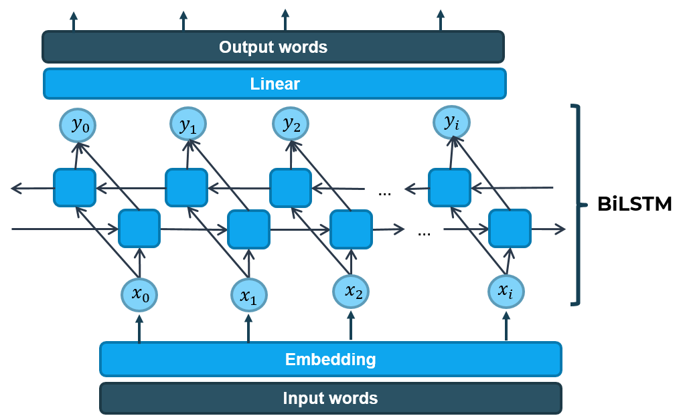

## 1. Lựa chọn mô hình

Các mô hình chúng tôi đã thử nghiệm gồm LSTM + Linear, Transformer Encoder + Linear và Evolved Transformer + Linear và theo hướng **Word to Word**. Các mô hình nhận đầu vào là các từ không dấu (hoặc đã loại bỏ dấu). Với mỗi từ đầu vào, mô hình sẽ phán đoán từ đầu ra là từ nào trong khoảng 9000 từ tiếng Việt (ở đây hiểu là *tiếng* hoặc *từ đơn*). Với phương pháp này, số lượng lớp đầu ra khá lớn, ứng với số lượng từ đơn (tiếng) trong tiếng Việt. Một nhược điểm khác của phương pháp này là các từ dự đoán ra có thể khác hẳn từ đầu vào, hay từ đầu vào không phải là dạng bỏ dấu của từ đã cho. Ví dụ khi từ đầu vào là "cho" thì từ đầu ra hoàn toàn có thể là "mèo" thay vì là "chó". Để khắc phục tình trạng này, thay vì lựa chọn từ có xác suất cao nhất, chúng tôi sắp xếp các từ theo thứ tự giảm dần, sau đó lựa chọn trong các từ dự đoán một từ có xác suất cao nhất mà khi bỏ dấu sẽ thu được từ đầu vào.

Chúng tôi cũng đã nghĩ đến phương pháp dự đoán dấu câu cho mỗi từ, thay vì dự đoán một từ đã thêm dấu tương ứng, tuy nhiên chưa có đủ thời gian thử nghiệm. Với cách này, chúng ta có thể giảm số lượng lớp phải dự đoán của mô hình và loại bỏ khả năng dự đoán ra từ khác hẳn với từ đã cho như ở họ mô hình trước. Mô hình dự đoán dấu câu như hình dưới.

### 1.1. Mô hình LSTM + Linear

Các mô hình [RNN (Recurrent Neural Network)](https://en.wikipedia.org/wiki/Recurrent_neural_network) thường được ứng dụng để xử lý các thông tin dạng chuỗi. Ở đây, mỗi câu không dấu đưa vào có thể coi là một chuỗi, và ứng dụng mô hình RNN để xử lý. So với mạng RNN thuần, [LSTM (Long Short-Term Memory)](https://en.wikipedia.org/wiki/Long_short-term_memory) là một cải tiến nhằm hạn chế sự phụ thuộc xa (long-term dependencies) và vanishing gradient. Nó khiến việc học trở nên hiệu quả hơn nhiều các mạng RNN truyền thống. Kiến trúc LSTM được chúng tôi cài đặt kết hợp với lớp Linear (Fully connected) như hình dưới để dự đoán từ có dấu dựa vào từ không dầu.

Mô hình LSTM trên là mô hình baseline đơn giản nhất ứng dụng học sâu để thêm dấu tiếng Việt. Từ mô hình này, chúng tôi cải tiến và triển khai thêm mô hình LSTM hai chiều (Bi-directional LSTM) để tăng độ chính xác. Mô hình Bi-directional LSTM được chúng tôi cài đặt như sau.

### 1.2. Mô hình Transformer

#### Thiết kế chung của Transformer

Các mô hình RNN, [GRU (Gated Recurrent Unit)](https://en.wikipedia.org/wiki/Gated_recurrent_unit), LSTM hay các cải tiến khác về sau được sử dụng kết hợp với [cơ chế attention](https://d2l.ai/chapter_attention-mechanisms/) để cải thiện thêm độ chính xác. Sau này, kiến trúc [Transformer](https://arxiv.org/abs/1706.03762) ra đời đưa ra một thiết kế hoàn toàn mới - chỉ sử dụng cơ chế attention mà không cần sử dụng các mạng tích chập (CNN) hoặc hồi tiếp (RNN) làm đầu vào. Kiến trúc của Transformer được thể hiện trong hình dưới.

Transformer được thiết kế dựa trên kiến trúc Encoder-Decoder. Có thể hiểu đơn giản, khối Encoder có khả năng tổng hợp thông tin từ đầu vào. Đầu ra của khối Encoder là đầu vào của khối Decoder. Khối Decoder sẽ dựa vào các thông tin tổng hợp được từ Encoder để đưa ra suy luận cho kết quả đầu ra.

Ở Transformer, chúng ta không thấy có dự xuất hiện của các khối mạng hồi tiếp để giữ thông tin về vị trí. Thay vào đó. Các tác giả sử dụng khổi Positional encoding để mã hoá thông tin vị trí vào giá trị đầu vào. Tiếp đó, mô hình sử dụng cơ chế multi-head attention để giúp mô hình có thể "attention" (chú ý) vào nhiều vị trí, đồng thời cũng có thể ánh xạ biểu diễn theo nhiều cách khác nhau thông qua nhiều bộ giá trị Query/Key/Value.

#### Sử dụng Transformer trong bài toán thêm dấu tiếng Việt

Chúng tôi chỉ sử dụng phần Encoder của mô hình Transformer cho bài toán của mình, sau đó kết hợp với một lớp Linear (Fully connected) và cho ra kết quả. Mô hình được mô tả như hình vẽ dưới.

### 1.3. Mô hình Evolved Transformer

#### Thiết kế chung của Evolved Transformer

Mô hình **Evolved Transformer** là một bản cải tiến của **Transformer** bằng cách sử dụng phương pháp tìm kiếm kiến trúc mạng NAS (neural architecture search) để cải tiến kiến trúc cũ. Dưới đây là một số khác biệt của Envolved Transformer so với Transformer nguyên bản.

#### Sử dụng Evolved Transformer trong bài toán thêm dấu tiếng Việt

Chúng tôi cũng sử dụng phần Encoder của mô hình Evolved Transformer cho bài toán của mình, sau đó kết hợp với một lớp Linear (Fully connected) và cho ra kết quả. Mô hình được mô tả như hình vẽ dưới.

## 2. Tokenizer

Để huấn luyện mô hình, chúng ta phải đưa vào dữ liệu dạng số. Chúng ta sẽ tạo một tham chiếu từ 1 từ sang 1 số và đưa vào mô hình dạng số của mỗi từ. Tham chiếu này được gọi là **tokenizer**. Khái niệm *từ* ở đây giống ở tiếng Anh, tức là tương đương một *tiếng*, hay *từ đơn* ở trong tiếng Việt. Chúng tôi không dùng tokenizer tạo từ các tập data trên mà dùng một danh sách từ lấy tại [vietnamese-wordlist](https://github.com/VNOpenAI/vietnamese-wordlist) để tạo bộ tokenizer bằng cách cắt các từ trong đó và chọn lại các từ đơn. Kết quả được khoảng 9000 từ có dấu, tương đương với khoảng 3000 từ đã bỏ dấu. Bộ tokenizer ở đây được xây dựng đơn giản bằng cách tham chiếu một từ với số thứ tự của nó trong danh sách thu được.

## 3. Kết quả thử nghiệm

### 3.1. Độ đo đánh giá mô hình

Độ chính xác của mô hình được tính bằng công thức $Acc = R / N$, trong đó $R$ là số chữ được dự đoán đúng dâu câu, $N$ là tổng số chữ trong văn bản.

### 3.2. Kết quả

Kết quả kiểm thử (độ chính xác) trên tập giám sát (validation) của các mô hình như sau.

|Mô hình| Tham số huấn luyện | Độ chính xác |
|---|---|---|
|Large BiLSTM|Adam, betas=(0.9, 0.98), lr=1e-4, epochs=19| 95.90% |
|Transformer |Adam, betas=(0.9, 0.98), lr=3e-4, epochs=26| 84.59% |
|Evolved Transformer |Adam, betas=(0.9, 0.98), lr=3e-4, epochs=15| 98.12% |

Như vậy, mô hình này đạt độ chính xác tốt nhất trong các mô hình chúng tôi đã triển khai. Mô hình này đạt độ chính xác 98.07% trên tập kiểm thử (test set).

*\*Hình ảnh được lấy từ slide: [slides/vnopenai-vn-accent.pptx](/slides/vnopenai-vn-accent.pptx)*