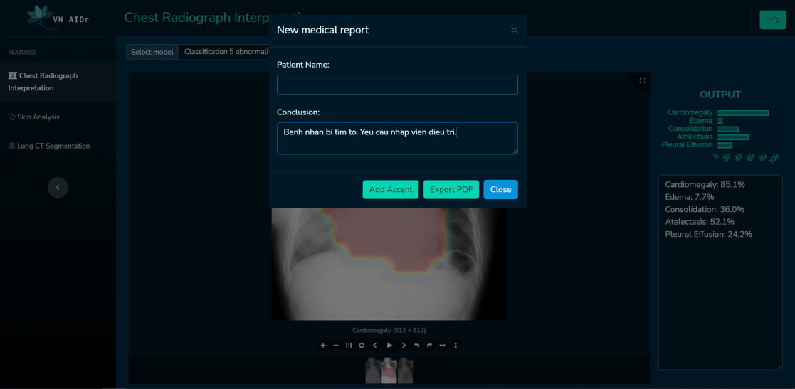
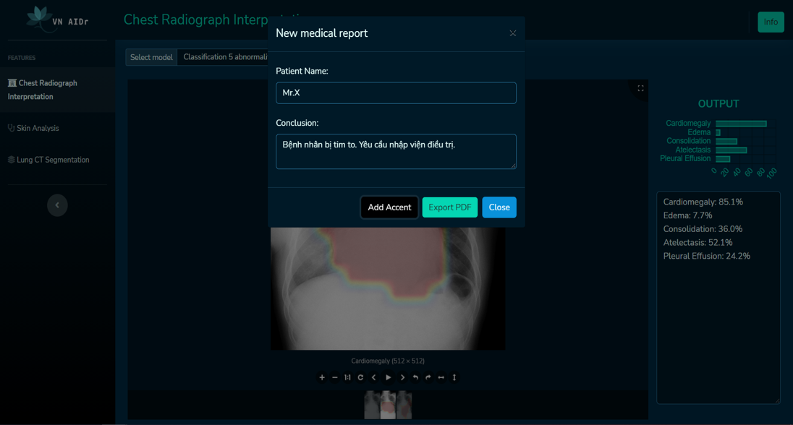

Khi triển khai lên phần mềm VN AIDr, chúng tôi viết thêm các đoạn mã tiền/hậu xử lý để việc thêm dấu giữ lại được đúng định dạng đầu vào của văn bản như vị trí chữ cần thêm dấu, định dạng hoa/thường, các ký tự đặc biệt... Dưới đây là một số màn hình khi các mô hình được triển khai vào VN AIDr.

