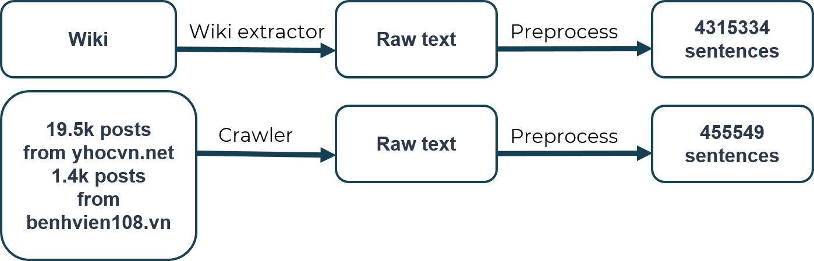

Bài toán thêm dấu tiếng Việt giải quyết việc thêm dấu cho các văn bản tiếng Việt không dấu. Trên thực tế, bài toán này đã được ứng dụng rất hiệu quả trong [trình duyệt Cốc Cốc](https://coccoc.com/) nhắm tiết kiệm thời gian nhập văn bản của người dùng và nhận được nhiều hưởng ứng tích cực. Trong dự án này, chúng tôi thiết kế và thử nghiệm một hệ thống thêm dấu tiếng Việt cho báo cáo y tế. Hệ thống được ứng dụng trong phần mềm VN AIDr nhằm giúp bác sĩ tiết kiệm thời gian gõ văn bản y tế, ví dụ như nhận xét tình trạng của bệnh nhân. Chúng tôi hy vọng hệ thống này có thể rút ngắn thời gian nhập liệu và góp phần giảm tải áp lực cho bác sĩ.

## I. Dữ liệu

### 1. Thu thập và tiền xử lý dữ liệu

Dữ liệu dùng cho bài toán này được chúng tôi thu thập từ 2 nguồn chính: (1) Wikipedia và (2) dữ liệu bài viết trên [yhocvn.net](https://yhocvn.net/) và [benhvien108.vn](https://benhvien108.vn/).

- **Với Wikipedia:** Dữ liệu được tải về từ [dumps.wikimedia.org](https://dumps.wikimedia.org) và trích xuất văn bản với gói [wikiextractor](https://pypi.org/project/wikiextractor/). Tiếp đó dữ liệu được tiền xử lý và trích xuất được 4315334 câu. Nhằm tiết kiệm thời gian, chúng tôi lấy dữ liệu đã được xử lý sẵn từ [trang này](https://phamdinhkhanh.github.io/2020/05/28/TransformerThemDauTV.html).

- **Với các trang [yhocvn.net](https://yhocvn.net/) và [benhvien108.vn](https://benhvien108.vn/):** Chúng tôi cào được 19.5 nghìn bài viết từ [yhocvn.net](https://yhocvn.net/) và hơn 1400 bài viết từ [benhvien108.vn](https://benhvien108.vn/). Sau khi qua bước tiền xử lý, chúng tôi trích xuất được 455549 câu.

**Các bước tiền xử lý bao gồm:**

- Tách các câu dựa vào các dấu chấm câu.
- Với mỗi câu: loại bỏ các chữ số, dấu câu, các kí tự đặc biệt, chỉ giữ lại các từ tạo nên bởi các chữ cái tiếng Việt và tiếng Anh, ngăn cách chúng bởi 1 dấu cách.
- Chuyển các câu về chữ thường.
- Chuẩn hoá dấu câu: Trong các văn bản tiếng Việt, vị trí chữ cái bỏ dấu có thể không đồng nhất. Ví dụ với chữ "hoà", có văn bản viết "hoà", cũng có văn bản viết là "hòa". Chúng tôi thực hiện đưa vị trí bỏ dấu về một chuẩn chung. Trong trường hợp này, cả "hoà" và "hoà" đều được chuẩn hoá lại thành "hoà".
- Loại bỏ các câu có dưới 10 từ và lớn hơn 200 từ rồi ghi ra tệp văn bản.
- Tạo dữ liệu không dấu bằng cách loại bỏ dấu câu thông qua mã nguồn từ [aivivn.com](https://www.aivivn.com/contests/3).

**Mã nguồn tiền xử lý dữ liệu:** 
- <https://github.com/VNOpenAI/vn-accent/blob/master/preprocess_data/Preprocess_data_Wikipedia.ipynb>.
- <https://github.com/VNOpenAI/vn-accent/blob/master/preprocess_data/Preprocess_data_yhocvn_net_benhvien108_vn.ipynb>.

### 2. Chia dữ liệu

Các dữ liệu từ bước trên, sau quá trình xử lý được gộp vào nhau, trộn ngẫu nhiên và chia thành 3 tập: tập huần luyện (training set) gồm 4750883 câu, tập giám sát (validation set) gồm 10000 câu và tập kiểm thử (test set) gồm 10000 câu.

**Mã nguồn chia dữ liệu:**  <https://github.com/VNOpenAI/vn-accent/blob/master/preprocess_data/split_data.py>

## II. Huấn luyện

## 1. Lựa chọn mô hình

Các mô hình chúng tôi đã thử nghiệm gồm Transformer Encoder + Linear, Evolved Transformer + Linear và LSTM + Linear, theo hướng **Word to Word**. Các mô hình nhận đầu vào là các từ không dấu (hoặc đã loại bỏ dấu). Với mỗi từ đầu vào, mô hình sẽ phán đoán từ đầu ra là từ nào trong khoảng 9000 từ tiếng Việt (ở đây hiểu là *tiếng* hoặc *từ đơn*). Với phương pháp này, số lượng lớp đầu ra khá lớn, ứng với số lượng từ đơn (tiếng) trong tiếng Việt. Một nhược điểm khác của phương pháp này là các từ dự đoán ra có thể khác hẳn từ đầu vào, hay từ đầu vào không phải là dạng bỏ dấu của từ đã cho. Ví dụ khi từ đầu vào là "cho" thì từ đầu ra hoàn toàn có thể là "mèo" thay vì là "chó". Để khắc phục tình trạng này, thay vì lựa chọn từ có xác suất cao nhất, chúng tôi sắp xếp các từ theo thứ tự giảm dần, sau đó lựa chọn trong các từ dự đoán một từ có xác suất cao nhất mà khi bỏ dấu sẽ thu được từ đầu vào.

Chúng tôi cũng đã nghĩ đến phương pháp dự đoán dấu câu cho mỗi từ, thay vì dự đoán một từ đã thêm dấu tương ứng, tuy nhiên chưa có đủ thời gian thử nghiệm. Với cách này, chúng ta có thể giảm số lượng lớp phải dự đoán của mô hình và loại bỏ khả năng dự đoán ra từ khác hẳn với từ đã cho như ở họ mô hình trước. Mô hình dự đoán dấu câu như hình dưới.

## 2. Tokenizer

Để huấn luyện mô hình, chúng ta phải đưa vào dữ liệu dạng số. Chúng ta sẽ tạo một tham chiếu từ 1 từ sang 1 số và đưa vào mô hình dạng số của mỗi từ. Tham chiếu này được gọi là **tokenizer**. Khái niệm *từ* ở đây giống ở tiếng Anh, tức là tương đương một *tiếng*, hay *từ đơn* ở trong tiếng Việt. Chúng tôi không dùng tokenizer tạo từ các tập data trên mà dùng một danh sách từ lấy tại [vietnamese-wordlist](https://github.com/VNOpenAI/vietnamese-wordlist) để tạo bộ tokenizer bằng cách cắt các từ trong đó và chọn lại các từ đơn. Kết quả được khoảng 9000 từ có dấu, tương đương với khoảng 3000 từ đã bỏ dấu. Bộ tokenizer ở đây được xây dựng đơn giản bằng cách tham chiếu một từ với số thứ tự của nó trong danh sách thu được.

## 3. Kết quả thử nghiệm
### 3.1. Độ đo đánh giá mô hình

Độ chính xác của mô hình được tính bằng công thức $Acc = R / N$, trong đó $R$ là số chữ được dự đoán đúng dâu câu, $N$ là tổng số chữ trong văn bản.

### 3.2. Kết quả

Kết quả kiểm thử (độ chính xác) trên tập test của các mô hình như sau:

|Mô hình| Tham số huấn luyện | Độ chính xác |
|---|---|---|
|Large BiLSTM|Adam, betas=(0.9, 0.98), lr=1e-4, epochs=19|Đang cập nhật...|
|Evolved Transformer |Adam, betas=(0.9, 0.98), lr=3e-4, epochs=14| 97.94% |
|Transformer |Đang cập nhật...| Đang cập nhật... |

## 4. Triển khai

Khi triển khai lên phần mềm VN AIDr, chúng tôi viết thêm các đoạn mã tiền/hậu xử lý để việc thêm dấu giữ lại được đúng định dạng đầu vào của văn bản như vị trí chữ cần thêm dấu, 

*\*Hình ảnh được lấy từ slide: [slides/vnopenai-vn-accent.pptx](/slides/vnopenai-vn-accent.pptx)*