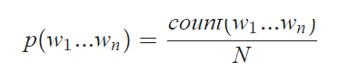
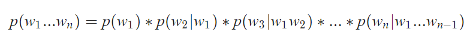
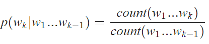
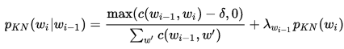
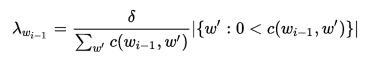
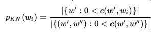
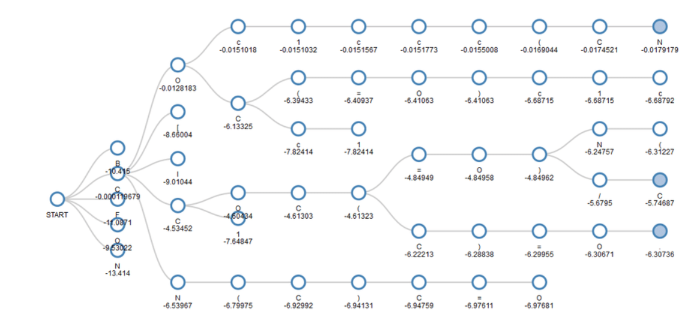

## 1. Mô hình

### 1.1. Mô hình N-grams

N-grams được hiểu đơn giản là tần suất xuất hiện của n kí tự (từ) liên tiếp xuất
hiện trong dữ hiêu

**Một số mô hình n-grams phổ biến**

-   **unigram**, mô hình với n=1, tức là ta sẽ tính tần suất xuất hiện của một kí tự
    (từ), như: "k", "a",...

-   **bigrams** với n=2 , là mô hình được sử dụng nhiều trong việc phân tích các hình
    thái cho ngôn ngữ

-   **trigrams** với n-3, với n càng lớn thì độ chính xác càng cao tuy nhiên đi kèm
    với đó thì độ phức tạp cũng lớn hơn

Để xây dựng một mô hình n-gram, ban đầu người ta dựa trên một tập dữ liệu huấn
luyện( Tranning set). Sau khi mô hình được xây dựng, ta tiến hành kiểm tra mô
hình dựa trên một tập dữ liệu test. Việc kiểm tra tốt nhất là sử dụng một tập dữ
kiệu không có trong tập huấn luyện. Dựa vào việc kiểm tra này mà ta có thể biết
được mô hình có tốt hay khôngx.

**Mô hình N-gram:**

-   Để tính xác suất của một câu: W1W2....Wk....Wn. Theo công thức Bayes ta sẽ
    tính bằng cách:

-   Tuy nhiên, công thức trên có độ phức tạp lớn, vì vậy người ta thường sử dụng
    công thức Markov:

    Trong đó:

Do khi tính xác suất có nhiều trường hợp sẽ gặp các cụm n-grams chưa xuất hiện
hoặc do sự phân bố không đều trong tập huấn luyện sẽ dẫn tới việc tính toán
không chính xác. Vì vậy người ta đưa ra phương pháp làm mịn để khắc phục vấn đề
này

**Một số phương pháp làm mịn phổ biến:**

-   Discounting: giảm xác suất các cụm n-grams có xác suất lớn hơn 0 để bù cho
    các cụm n-grams chưa xuất hiện

-   Back-off: tính xác suất các cụm n-grams chưa xuất hiện bằng các cụm ngắn hơn
    và có xác suất lớn hơn 0

-   Interpolation: tính xác suất của tất cả các cụm n-grams bằng các cụm ngắn hơn

**Làm mịn bằng phương pháp Kneser – Ney smoothing (Interpolation).**

-   Kneser-Ney là phương pháp chủ yếu được sử dụng để tính toán phân bố xác suất
    của n-grams trong một tài liệu dựa trên những tính toán đã có.

-   Kneser-Ney được coi là phương pháp hiệu quả nhất để làm mịn do việc sử dụng
    các chiết khấu tuyệt đối bằng cách trừ đi một giá trị cố định từ điều kiện
    về tần số bậc thấp của xác suất để bỏ qua n-grams với tần số thấp hơn. Đây là
    phương pháp hiệu quả với bigrams và các mô hình n-grams cao hơn.

-   Một ví dụ phổ biến để minh họa các khái niệm đằng sau phương pháp này là tần
    số Bigrams cảu cụm "San Francisco". Nếu nó xuất hiện nhiều lần trong một ngữ
    liệu huấn luyện, tần số của unigrams "Francisco" cũng sẽ cao. Dựa vào chỉ có
    tần số unigrams để dự đoán các tần số của n-grams sẽ dẫn đến kết quả sai lệch.
    Tuy nhiên, Kneser-Ney mịn chỉnh này bằng cách xem xét các tần số của unigram
    liên quan đến những từ ở trước.

-   Công thức Kneser – ney:

### 1.2. Thuật toán tìm kiếm

Trong xử lý ngôn ngữ tự nhiên, như các bài toán dịch máy hay bài toán tạo tiêu
đề đều có thể đưa về bài toán sinh chuỗi từ.

Các mô hình sinh kiểu này thường tính xác suất xuất hiện của từng từ trong chuỗi
từ ở đầu ra, vì vậy cần một thuật toán giải mã để tìm ra chuỗi từ có xác suất
lớn nhất. Trong project này, chúng tôi đưa ra hai thuật toán cơ bản để tìm kiếm
chuỗi từ, đó là thuật toán tham ăn (greedy) và thuật toán beam search.

Khi sử dụng các mô hình ngôn ngữ hay các mạng nở ron hồi quy, thì đầu ra của các
mô hình này là các từ trong từ điển và xác suất xuất hiện các từ đó trong ngữ
cảnh tương ứng. Thuật toán tìm kiếm sẽ tìm trên toàn bộ các chuỗi này và tìm ra
chuỗi từ có xác suất xuất hiện lớn nhất. Kích thước của từ điển phụ thuộc vào
bài toán, thường là vài trăm, vài nghìn hoặc thậm chí vài triệu từ. Bài toán tìm
kiếm này có độ phức tạp tăng theo hàm mũ của độ dài câu, là bài tóan NP-đủ, vì
vậy không thể giải đúng được.

Trong thực tế, các phương pháp heuristic được sử dụng để tìm nghiệm xấp xỉ "đủ
tốt" cho bài toán này.

**Thuật toán tham ăn**

Ở giải thuật tìm kiếm tham ăn, tại mỗi bước tìm kiếm, chọn ra trong tập dự đoán
từ nào có xác suất cao nhất. Sau đó lặp lại quá trình trên.

Ưu điểm của thuật toán này chính là tốc độ, trong khi nhược điểm là độ chính xác
không hề cao, kết quả có thể khác xa kết quả tối ưu. Do chỉ cần sai một từ thì
các từ tiếp theo sẽ bị ảnh hưởng nhiều.

**Thuật toán beam search**

Là một thuật toán tìm kiếm theo chiều rộng.

Thay vì chỉ lấy một trường hợp có xác suất cao nhất tại mỗi bước, beam search mở
rộng trường tìm kiếm bằng cách giữ lại k khả năng có xác suất cao nhất, với k là
hằng số được lựa chọn. Các bước tiếp theo lặp lại trên k mẫu trước đó, và nhưng
sau đó cũng chỉ giữ lại k mẫu cho bước tiếp theo. Cứ như vậy cho tới bước cuối
cùng thì chọn mẫu có xác suất cao nhất trong k mẫu.

## Kết quả thực nghiệm

Bài toán thêm dấu được thực hiện theo các bước như sau:

-   Xây dựng mô hình Trigrams để đưa ra xác suất xuất hiện 1 từ nếu biết 2 từ
    đứng trước nó

-   Đối với mỗi từ Tiếng Việt không dấu, tiến hành generate tất cả các trường
    hợp có thể điền dấu cho từ

-   Sử dụng thuật toán tham ăn hoặc thuật toán beam search để lấy ra được câu
    cho xác suất lớn nhất

-   Test thử kết quả

Trong project này, chúng tôi thử nghiệm 2 mô hình phổ biến đó là mô hình 3-gram
và 2-gram. Kết quả dưới đây là độ chính xác được tính trên tập validation với
các tham số khác nhau của thuật toán beam search.

| **N_gram** | **N\_beam** | **Val_score** | **Seconds/sentence** | **Test score** | **Model size** |
|------------|-------------|---------------|----------------------|----------------|----------------|
| 2grams     | 1           | 0.8231        | 8.5                  |                | 41Mb           |
|            | 2           | 0.8905        | 14.65                |                |                |
|            | 3           | 0.9138        | 15                   |                |                |
|            | 4           | 0.9216        | 16.5                 |                |                |
|            | 5           | 0.9258        | 18.3                 | 0.9221         |                |
|            | 6           | 0.9273        | 18.5                 |                |                |
|            | 7           | 0.9282        | 18.9                 |                |                |
| 3grams     | 1           | 0.884         | 9                    |                |                |
|            | 2           | 0.9128        | 15.5                 |                |                |
|            | 3           | 0.9309        | 14.35                |                |                |
|            | 4           | 0.9369        | 19.5                 |                |                |
|            | 5           | 0.9411        | 25.5                 | 0.9401         | 441Mb          |
|            | 6           | 0.9438        | 26.5                 |                |                |
|            | 7           | 0.9453        | 31.9                 |                |                |

## Tham khảo

- <https://viblo.asia/p/language-modeling-mo-hinh-ngon-ngu-va-bai-toan-them-dau-cau-trong-tieng-viet-1VgZveV2KAw?fbclid=IwAR27jOzmETv8zUj-idE5uMh7BGuKQqvOMtnTRpAdqVhhVwDHXbuTfYy59J0>

- <https://machinelearningmastery.com/beam-search-decoder-natural-language-processing>
