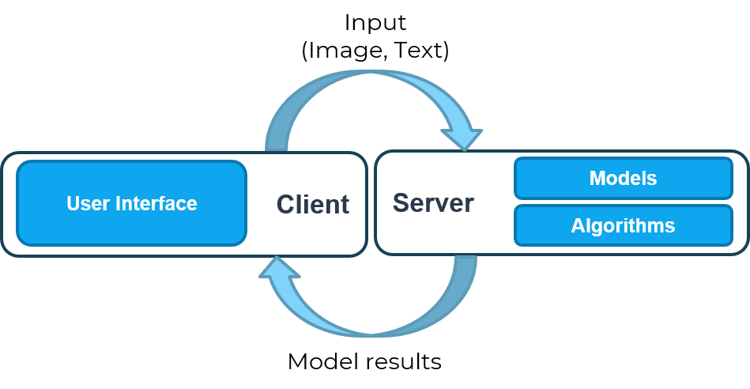

## 1. Tổng quan

Chúng tôi xây dựng phần mềm xử lý ảnh y tế **VN AIDr** như một giao diện để tương tác với các thuật toán và mô hình đã huấn luyện. Toàn bộ mã nguồn **VN AIDr** được xây dựng trên nguyên tắc đơn giản, dễ dùng, dễ mở rộng để sử dụng với các mô hình và nhiệm vụ khác. Phía dưới đây là demo giao diện chương trình.

[](https://youtu.be/pw62Hxy-BeE)

Frontend của phần mềm hiện đang sử dụng sử dụng các framework Bootstrap, Jquery. Phần backend đang sử dụng framework [FastAPI](https://fastapi.tiangolo.com/). Chúng tôi có dự định chuyển frontend của phần mềm sang sử dụng [ReactJS](https://reactjs.org/), và đang cần thêm lập trình viên tham gia dự án. Nếu các bạn mong muốn tham gia cùng chúng tôi, cùng xây dựng VN AIDr tốt hơn mỗi ngày, hãy gửi cho chúng tôi một tin nhắn tại [trang liên hệ của VNOpenAI](https://vnopenai.github.io/contact/).

## 2. Luồng hoạt động

Chương trình được xây dựng trên nền tảng web. Các mô hình và thuật toán được thiết kế để thực thi trên server. Người dùng sẽ lựa chọn và tải lên các ảnh cần xử lý. Server thực hiện phân tích, xử lý ảnh, thực thi các mô hình ngôn ngữ và trả kết quả về client. 




## 3. Mã nguồn

Toàn bộ mã nguồn của dự án **VN AIDr** đều được mở cho cộng đồng. Chúng tôi rất hoan nghênh các đóng góp của các bạn cho mã nguồn, mô hình và các ý kiến liên quan đến y học. Mã nguồn có thể được đóng góp trực tiếp bằng cách tạo pull request tại các repo của dự án. Các ý kiến khác có thể được gửi qua [Trang liên hệ](https://vnopenai.github.io/contact/).

- Mã nguồn của nền tảng VN AIDr: <https://github.com/VNOpenAI/vn-aidr>.

## 4. Thiết lập và chạy thử
### Yêu cầu hệ thống:

- Python 3.7 + Pip. Chúng tôi khuyến khích các bạn sử dụng [Miniconda](https://docs.conda.io/en/latest/miniconda.html) hoặc [Anaconda](https://www.anaconda.com/).
- [NodeJS](https://nodejs.vn/).
- [Yarn](https://yarnpkg.com/).

### Thiết lập môi trường

Clone mã nguồn:

```
git clone https://github.com/VNOpenAI/vn-aidr
cd vn-aidr
```

Nếu bạn sử dụng Windows, vui lòng tham khảo cách cài đặt `detectron2` cho Windows 10 tại: <https://dgmaxime.medium.com/how-to-easily-install-detectron2-on-windows-10-39186139101c>.

Cài đặt các gói cần thiết cho server:

```sh
pip install -r requirements.txt
```

Cài đặt các gói cần thiết để chỉnh sửa frontend:

```sh
cd frontend
yarn
```

### Các bước chạy server

Khởi server với các lệnh sau:

```sh
python app.py --port=5000
```

Sau khi server được khởi chạy, mở `http://localhost:5000` để vào giao diện web.

### Chỉnh sửa frontend

Để chỉnh sửa giao diện, cần chạy lệnh sau để liên tục theo dõi và cập nhật các chỉnh sửa liên quan đến giao diện:

```
cd frontend
yarn start
```

Sau khi chỉnh sửa hoàn tất, chúng ta cần build (sinh) lại giao diện frontend cuối cùng, dùng cho sản phẩm cuối:

```
cd frontend
yarn build
```