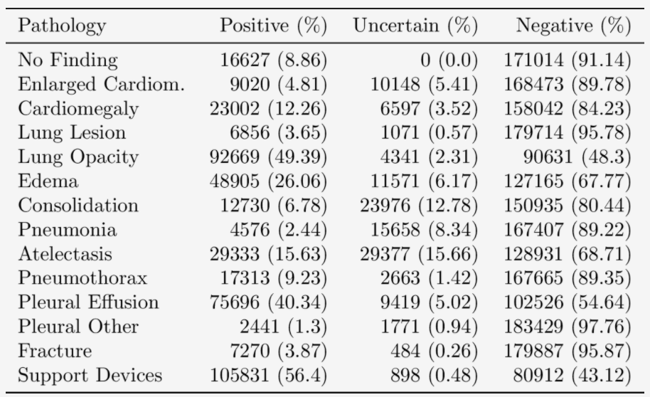

## 1. Bộ dữ liệu 

CheXpert bao gồm 224316 ảnh chụp X-quang ngực của 65240 bệnh nhân được
lấy từ bênh viện Stanford. Bộ dataset được thu thập từ tháng 10/2002 đến
thành 7/2017 với cả bệnh nhân nội trú và ngoại trú cùng với các báo cáo
X-quang liên quan.

Các thông tin trong báo cáo X-quang sẽ được trích xuất, phân loại và
tổng hợp để gán nhãn cho 14 quan sát trên phổi. Mỗi quan sát sẽ ứng với
một đặc điểm khác thường của phổi. Mỗi quan sát sẽ được gán nhãn *dương
tính (positive)*, *âm tính (negative)*, hoặc *không chắc chắn
(uncertain)*. (**0** for negative, **-1** for uncertain, and **1** for
positive).

Chúng tôi chỉ tập trung vào việc đánh giá 5 trong 14 quan sát, được lựa chọn dựa trên mức độ quan trọng và phổ biến trên lâm sàng: 

- (a) Xẹp phổi (Atelectasis)
- (b) Tim to (Cardiomegaly)
- (c) Đông đặc phổi (Consolidation)
- (d) Phù nề (Edema)
- (e) Tràn dịch màng phổi (Pleural Effusion)

## 2. Phân chia dữ liệu thử nghiệm

Dữ liệu được chia thành 2 tập là tập huấn luyện (training set) với 223414 ảnh và tập giám sát (validation set) với 234 ảnh. Chúng tôi thực hiện đánh giá các thử nghiệm trên tập giám sát này.
