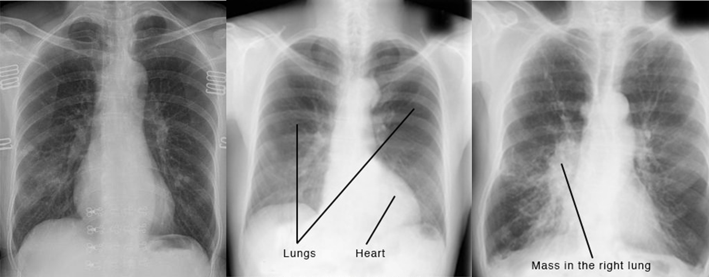
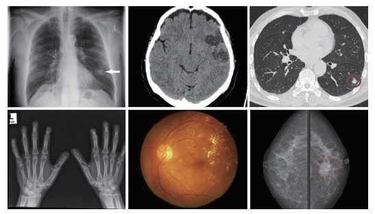
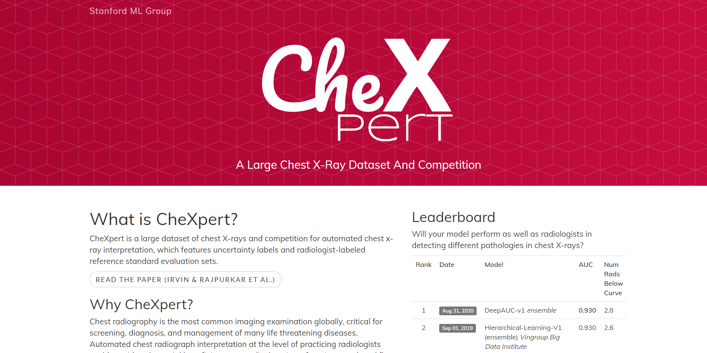

## 1. Chuẩn đoán các bệnh phổi trên ảnh X-quang

### 1.1. Giới thiệu

Chụp X-quang ngực (Chest X-ray – CXR) là một trong những xét nghiệm ảnh
phổ biến nhất trong chẩn đoán nhiều bệnh khác nhau liên quan đến phổi và
tim, với hàng triệu scans được thực hiện toàn cầu mỗi năm. Nhiều bệnh
trong số đó, như Pneumothorax (Phổi tràn khí), có thể gây chết người nếu
không được chẩn đoán đủ nhanh và chính xác. Một hệ thống chẩn đoán có sự
hỗ trợ của máy tính (computer-aided diagnosis – CAD) có thể chẩn đoán
chính xác những quan sát phổ biến nhất từ ảnh chụp X-quang ngực sẽ mang
lại lợi ích đáng kể cho nhiều thực hành lâm sàng. Trong báo cáo này,
chúng tôi nghiên cứu bài toán phân loại đa nhãn (*multi-label
classification*) cho ảnh chụp X-quang ngực bằng cách sử dụng mạng nơ-ron
tích chập (*convolutional neural networks – CNNs*).

Những nghiên cứu gần đây đang tập trung khai thác những tiến bộ trong
học máy, đặc biệt là học sâu, để xây dựng một nhóm hệ thống CAD mới để
phân loại và xác định vị trí các bệnh thường gặp ở lồng ngực từ hình ảnh
CXR. Một số lý do đằng sau sự biến đổi này:

-   Thứ nhất, việc giải thích CXR để chẩn đoán chính xác bệnh lý là
    rất khó. Ngay cả những bác sĩ X quang được đào tạo bài bản cũng có
    thể dễ dàng mắc sai lầm do những thách thức trong việc phân biệt các
    loại bệnh lý khác nhau, nhiều bệnh lý thường có các đặc điểm hình
    ảnh giống nhau. Do đó, một phương pháp có thể phân loại và xác định
    chính xác vị trí các bệnh thường gặp ở lồng ngực có thể được sử dụng
    như một đầu đọc thứ hai để hỗ trợ quá trình ra quyết định của bác sĩ
    X quang và giúp giảm sai số chẩn đoán. Nó cũng giải quyết tình trạng
    thiếu chuyên môn chẩn đoán trong các lĩnh vực mà bác sĩ X quang hạn
    chế hoặc không có sẵn.

-   Thứ hai, một hệ thống như vậy có thể được sử dụng như một công cụ
    sàng lọc giúp giảm thời gian chờ đợi của bệnh nhân trong bệnh viện
    và cho phép các bên cung cấp dịch vụ chăm sóc phản ứng kịp thời với
    các tình huống khẩn cấp sớm hơn hoặc để tăng tốc quy trình làm việc
    chẩn đoán hình ảnh.

-   Thứ ba, mạng nơron sâu, đặc biệt là CNN, đã cho thấy hiệu suất đáng
    kể đối với các ứng dụng khác nhau trong phân tích hình ảnh y tế, bao
    gồm cả nhiệm vụ giải đoán CXR.

Một số phương pháp tiếp cận dựa trên học sâu (*deep learning – DL*) đã
được đề xuất để phân loại bệnh phổi và chứng minh rằng chúng có thể đạt
được hiệu quả tương đương con người. Tuy nhiên, hầu hết tất cả các
phương pháp này đều nhằm mục đích phát hiện một số bệnh cụ thể như viêm
phổi, lao, hoặc ung thư phổi. Trong khi đó, việc xây dựng một DL
framework thống nhất để phát hiện chính xác sự hiện diện của nhiều bệnh
lý lồng ngực phổ biến từ chụp X quang phổi vẫn là một nhiệm vụ khó khăn,
đòi hỏi nhiều nỗ lực nghiên cứu. Đặc biệt, chúng tôi nhận ra rằng các bộ
phân loại đa nhãn tiêu chuẩn thường bỏ qua kiến ​​thức chuyên ngành
(*domain knowledge*). Ví dụ, trong trường hợp dữ liệu CXR, làm thế nào
để tận dụng các phân loại lâm sàng của các mô hình bệnh tật và cách xử
lý các nhãn không chắc chắn (*uncertainty label*) vẫn còn là câu hỏi mở,
chưa nhận được nhiều sự quan tâm nghiên cứu. Điều này thúc đẩy chúng tôi
xây dựng và thử nghiệm một vài mô hình dự đoán dựa trên CNN để giải
thích CXR, trong đó sự phụ thuộc giữa các nhãn (*labels dependencies*)
và thông tin không chắc chắn được tính đến trong quá trình training và
inference. Cụ thể, chúng tôi phát triển một số phương pháp tiếp cận dựa
trên DL đưa các ý tưởng về *conditional training* và *label smoothing*
thành một phương pháp training mới để phân loại 14 bệnh phổi phổ biến và
các quan sát.

## 2. Bài toán phân loại bất thường trên phổi

Trong dự náy VN AIDr, chúng tôi xây dựng hệ thống đánh giá khả năng cho 5 bất thường trên ảnh X-quang phổi, với mong muốn hệ thống này có thể trợ giúp bác sĩ trong quá trình chẩn đoán triệu chứng từ ảnh y tế, hạn chế việc bỏ sót triệu chứng. Hệ thống phân loại tổn thương phổi được chúng tôi xây dựng dựa trên bộ dữ liệu lớn [CheXpert](https://stanfordmlgroup.github.io/competitions/chexpert/) của Đại học Stanford.

