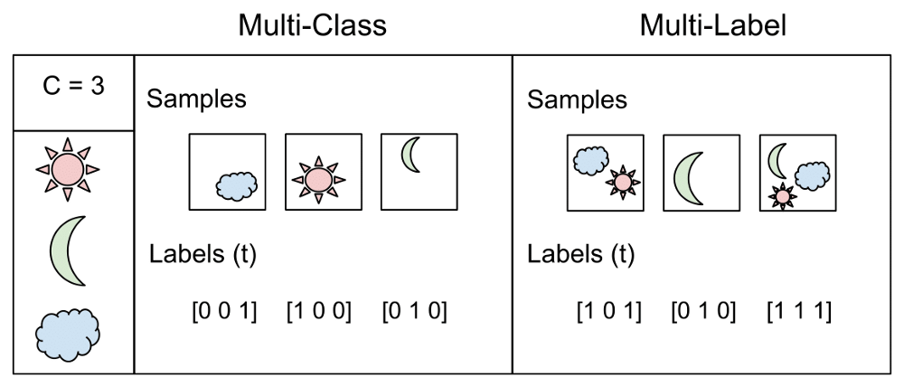
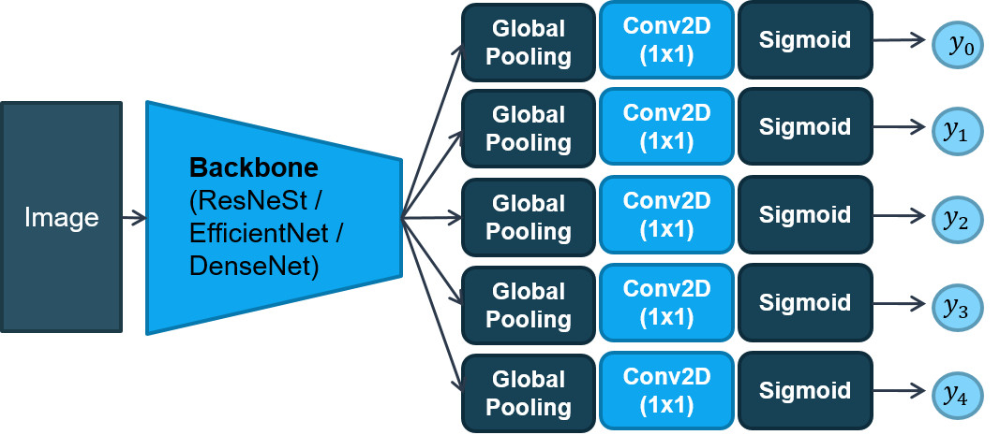
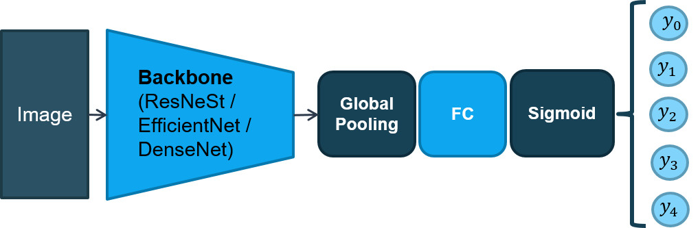
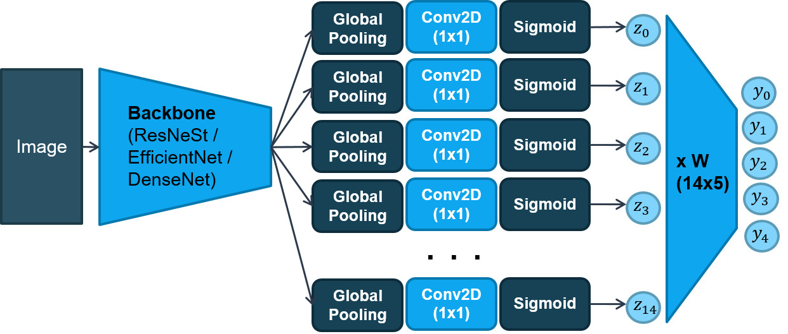
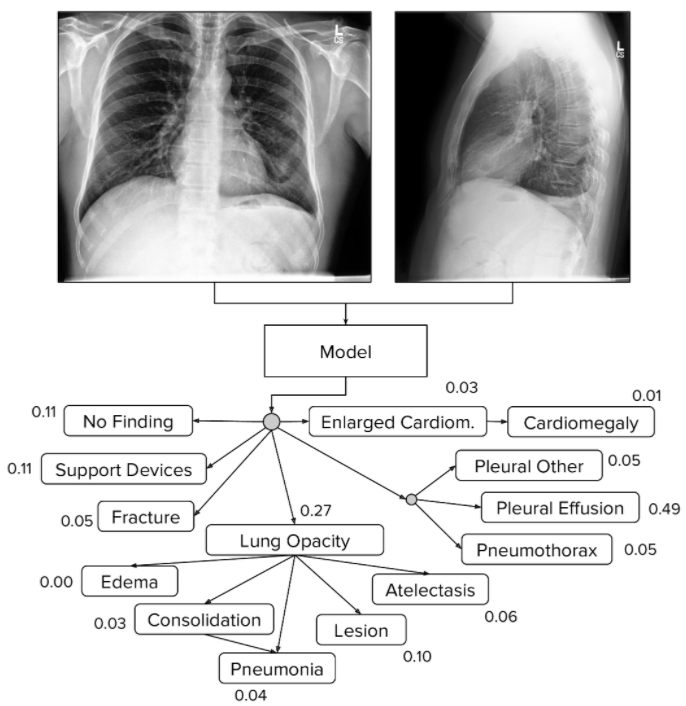
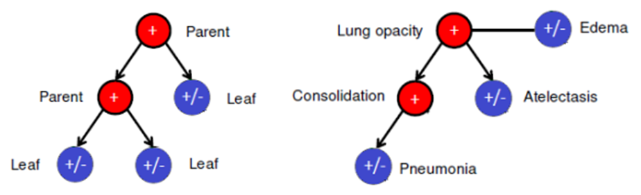

## 1. Bài toán Multi-Label Classification

Bài toán Multi-Label Classification bắt nguồn từ việc thử nghiệm vấn đề
phân loại văn bản, trong đó mỗi tài liệu có thể thuộc về một số chủ đề
được xác định trước đồng thời.

Multi-Label Classification trong ảnh y tế, đặc biệt là ảnh X-quang ngực
là một vấn đề quan trọng. Ví dụ một bức ảnh chụp phổi có thể có đồng
thời nhiều triệu chứng/ bệnh khác nhau như tim to, phổi đông đặc, phổi
tràn khí, v.v. Trong bài toán Multi-Label Classification, tập huấn luyện
bao gồm các cá thể, mỗi cá thể được liên kết với một tập nhãn và nhiệm
vụ là dự đoán các tập nhãn của các cá thể mới thông qua phân tích các cá
thể được train với các tập nhãn đã biết.

Sự khác biệt giữa Multi-Class Classification và Multi-Label
Classification là trong các bài toán nhiều lớp, các lớp loại trừ lẫn
nhau, trong khi đối với các bài toán nhiều nhãn, mỗi nhãn đại diện cho
một nhiệm vụ phân loại khác nhau, nhưng các nhiệm vụ có liên quan với
nhau. Ví dụ, phân loại nhiều lớp đưa ra giả định rằng mỗi mẫu được gán
cho một và chỉ một nhãn: một loại trái cây có thể là táo hoặc lê nhưng
không phải cả hai cùng một lúc. Trong khi đó, một ví dụ của phân loại
nhiều nhãn có thể là một văn bản có thể nói về bất kỳ tôn giáo, chính
trị, tài chính hoặc giáo dục nào cùng một lúc hoặc không có nội dung nào
trong số này.

Có hai hướng tiếp cận để giải quyết bài toán Multi-Label Classification:

-   Flat Multi-Label Classification (FMC): Tính tổng quát của các bài
    toán đa nhãn chắc chắn sẽ làm cho việc học trở nên khó khăn hơn. Một
    cách tiếp cận trực quan để giải quyết vấn đề nhiều nhãn là phân tách
    nó thành nhiều bài toán phân loại nhị phân độc lập (mỗi loại một).
    Giả định là các nhãn loại trừ lẫn nhau. Chúng ta không xem xét bất
    kỳ mối tương quan nào giữa các lớp trong phương pháp này.

-   Hierarchical Multi-Label Classification (HMC): Là một biến thể của
    bài toán classification, khi mỗi sample có thể có nhiều hơn một nhãn
    và tất cả các nhãn được tổ chức phân cấp dưới dạng trong một cây/
    Direct Acyclic Graph (DAG), để khai thác sự phụ thuộc giữa các nhãn
    dựa vào kiến thức chuyên ngành.

Trong báo cáo này, chúng tôi sẽ thực hiện thử nghiệm cả hai phương pháp
trên với 4 mô hình khác nhau trên tập data CheXpert.

## 2. Flat Multi-Label Classification (FMC)

### 2.1. Tiền xử lý dữ liệu

Các phương pháp tiền xử lý dữ liệu được sử dụng trong thử nghiệm với các
mô hình FMC bao gồm:

-   Cân bằng Histogram

-   Gaussian Blur

-   Padding và Resize ảnh về kích thước (512,512)

-   Chuẩn hóa ảnh (mean=128, std=64)

### 2.2. Tăng cường dữ liệu

Gia tăng dữ liệu là một phương pháp đơn giản nhưng rất quan trọng để
giúp giảm được hiện tượng quá khớp (over-fitting) trong quá trình huấn
luyện các mạng học sâu do sự giới hạn về số lượng dữ liệu.

Trong dự án này, các phương pháp augment sau sẽ được sử dụng:

-   Random Translate – dịch ngẫu nhiên ảnh

-   Random Scale – thay đổi kích thước ảnh

-   Random Rotate – Xoay ảnh

Các phương pháp augment trên sẽ được sử dụng chung cho thử nghiệm với
các mô hình FMC.

### 2.3. FMC-I (Architecture I)

### 2.4. FMC-II (Architecture II)

## 3. Hierarchical Multi-Label Classification (HMC)

### 3.1. Label smoothing regularization (LSR) cho các uncertainty

Một vấn đề thách thức khác trong phân loại đa nhãn của CXR là chúng ta
có thể không có toàn quyền truy cập vào các nhãn thực cho tất cả các
hình ảnh đầu vào do tập dữ liệu đào tạo cung cấp. Các bộ dữ liệu CXR quy
mô lớn được tạo ra với sự thật cơ bản đáng tin cậy hơn, chẳng hạn như
CheXpert và MIMIC-CXR. Tuy nhiên, việc gắn nhãn các bộ dữ liệu này phụ
thuộc rất nhiều vào các chuyên gia, điều này khiến nhiều hình ảnh CXR có
nhãn không chắc chắn (*uncertainty label*). Điều này chủ yếu là do sự mơ
hồ không thể tránh khỏi trong các báo cáo y tế. Một số cách tiếp cận đã
được đề xuất trong để giải quyết những mẫu này. Ví dụ: tất cả chúng có
thể bị bỏ qua (U-Bỏ qua), tất cả được ánh xạ tới dương (U-Ones) hoặc tất
cả được ánh xạ tới âm (U-Zeros). U-ignore không thể sử dụng danh sách
đầy đủ các nhãn trên toàn bộ tập dữ liệu, cả U-Ones và U-Zeros đều mang
lại một cải tiến tối thiểu trên CheXpert. Điều này có thể là do việc đặt
tất cả các nhãn không chắc chắn thành 1 hoặc 0 chắc chắn sẽ tạo ra rất
nhiều nhãn sai, dẫn đến việc đào tạo mô hình sai.

Lấy ý tưởng từ \[1\], trong bài báo này, chúng tôi sử dụng phương pháp
tên Label smoothing regularization (LSR) để xử lý tốt hơn các
uncertainty label. Mục tiêu chính là để khai thác số lượng lớn các CXR
không chắc chắn và đồng thời, để ngăn mô hình dự đoán quá tự tin về các
ví dụ đào tạo có thể chứa dữ liệu gắn nhãn sai. Cụ thể, cách tiếp cận
U-ones được làm mềm bằng cách ánh xạ mỗi nhãn độ không đảm bảo (−1) với
một số ngẫu nhiên gần bằng 1. Cách tiếp cận U-ones + LSR được đề xuất
hiện ánh xạ nhãn ban đầu yk (i) thành

$$
\bar{y}_{k}^{(i)}=\left\{\begin{array}{ll}
u, & \text { if } y_{k}^{(i)}=-1 \\
y_{k}^{(i)}, & \text { otherwise }
\end{array}\right.
$$

Trong đó u ∼ U (0.55; 0.85) là biến ngẫu nhiên được phân phối đồng đều
giữa 0.55 và 0.85. Tương tự, phương pháp tiếp cận U-zeros + LSR để làm
mềm U-zeros bằng cách đặt mỗi uncertainty label thành một số ngẫu nhiên
u ∼ U (0; 0.3).

### 3.2. Tiền xử lý dữ liệu

Các phương pháp tiền xử lý dữ liệu được sử dụng trong thử nghiệm với các
mô hình HMC bao gồm:

-   Resize ảnh về kích thước (256x256)

-   Chuẩn hóa ảnh (mean=128, std=64)

-   LSR

### 3.3. Tăng cường dữ liệu

Trong báo cáo này, các phương pháp augment sau sẽ được sử dụng:

-   Random Translate – dịch ngẫu nhiên ảnh

-   Random Scale – thay đổi kích thước ảnh

-   Random Rotate – Xoay ảnh

Các phương pháp augment trên sẽ được sử dụng chung cho thử nghiệm với
các mô hình HMC.

### 3.4. Mô hình Fully Associative Ensemble Learning (FAEL) \[2\]

### 3.5. Mô hình Conditional Training \[1\]**

Mô hình Conditional Training \[1\] đề xuất một phương pháp huấn luyện
mới cho bài toán Multi-Label Classification ảnh X-quang ngực có kết hợp:

-   Một quy trình huấn luyện có điều kiện (*conditional training*) dựa
    trên hệ thống phân cấp bệnh được định nghĩa trước bởi các
    chuyên gia.

-   Sử dụng kỹ thuật LSR cho các uncertainty label.

Conditional training khai thác hệ thống phân cấp qua 2 bước.

-   Bước đầu tiên, được gọi là conditional training, nhằm mục đích học
    các mối quan hệ phụ thuộc giữa parent và child labels và tập trung
    vào việc phân biệt các nhãn cấp dưới, đặc biệt là các nhãn lá. Trong
    bước này, CNN được pretrained trên một tập huấn luyện chứa tất cả
    các parent labels dương để phân loại các child labels.

-   Trong bước thứ hai, *transfer learning* sẽ được khai thác. Cụ thể,
    đóng băng tất cả các lớp của *pretrained model* ngoại trừ lớp *fully
    connected* cuối cùng và sau đó retrain trên tập dữ liệu đầy đủ. Giai
    đoạn training này để nâng cao khả năng dự đoán các parent labels
    của mạng.

## 4. Thử nghiệm và Kết quả

### 4.1. Thử nghiệm 1

\- Thử nghiệm 1 train và so sánh chất lượng của các mô hình *“flat
classification”* trên tập data CheXpert.

|             | Cardiomegaly | Edema     | Consolidation | Atelectasis | P.Effusion | Mean      |
|-------------|--------------|-----------|---------------|-------------|------------|-----------|
| ResNeSt50   | 0.858        | **0.937** | 0.913         | 0.859       | 0.921      | 0.898     |
| ResNeSt101  | **0.863**    | 0.922     | **0.935**     | 0.862       | 0.926      | 0.902     |
| EfficientB4 | 0.862        | 0.930     | 0.929         | **0.869**   | **0.928**  | **0.904** |
| DenseNet121 | 0.850        | 0.926     | 0.925         | 0.856       | 0.915      | 0.894     |

**Bảng 1**. Kết quả thử nghiệm với 4 backbone khác nhau của kiến trúc “flat
classification I”*

|             | Cardiomegaly | Edema     | Consolidation | Atelectasis | P.Effusion | Mean      |
|-------------|--------------|-----------|---------------|-------------|------------|-----------|
| ResNeSt50   | **0.850**    | 0.925     | 0.929         | 0.859       | **0.934**  | 0.899     |
| ResNeSt101  | 0.844        | 0.931     | **0.935**     | **0.875**   | 0.917      | **0.900** |
| EfficientB4 | 0.809        | **0.937** | 0.894         | 0.867       | 0.919      | 0.885     |
| DenseNet121 | 0.867        | 0.916     | 0.924         | 0.839       | 0.903      | 0.890     |

**Bảng 2**. Kết quả thử nghiệm với 4 backbone khác nhau của kiến trúc “flat
classification II”*

### 4.1. Thử nghiệm 2

\- Thử nghiệm 2 train và so sánh chất lượng của các mô hình *“hierarchical
classification”* trên tập data CheXpert

\- Kết quả thử nghiệm với mô hình FAEL (fully associative ensemble learning)

|               | Cardiomegaly | Edema     | Consolidation | Atelectasis | P.Effusion | Mean      |
|---------------|--------------|-----------|---------------|-------------|------------|-----------|
| ResNeSt50-B   | 0.729        | 0.895     | 0.898         | 0.835       | 0.928      | 0.857     |
| ResNeSt101-B  | 0.760        | **0.921** | 0.878         | 0.823       | **0.937**  | 0.864     |
| EfficientB4-B | 0.740        | 0.896     | **0.904**     | 0.809       | 0.931      | 0.856     |
| DenseNet121-B | 0.639        | 0.912     | 0.830         | 0.864       | 0.928      | 0.835     |
| ResNeSt50-F   | 0.767        | 0.873     | 0.904         | **0.862**   | 0.931      | 0.867     |
| ResNeSt101-F  | 0.769        | 0.889     | 0.895         | 0.850       | 0.937      | **0.868** |
| EfficientB4-F | **0.786**    | 0.860     | **0.918**     | 0.814       | 0.930      | 0.862     |
| DenseNet121-F | 0.726        | 0.914     | 0.867         | 0.858       | 0.930      | 0.859     |

**Bảng 3**. Kết quả thử nghiệm với 4 backbone khác nhau của mô hình FAEL*

\- Kết quả thử nghiệm với mô hình Conditional Training:

|             | Cardiomegaly | Edema     | Consolidation | Atelectasis | P.Effusion | Mean      |
|-------------|--------------|-----------|---------------|-------------|------------|-----------|
| ResNeSt50   | 0.773        | 0.912     | 0.874         | 0.797       | 0.879      | 0.847     |
| ResNeSt101  | 0.790        | 0.914     | 0.883         | 0.786       | **0.905**  | **0.856** |
| EfficientB4 | 0.763        | **0.928** | 0.858         | 0.773       | 0.888      | 0.842     |
| DenseNet121 | **0.793**    | 0.918     | **0.886**     | **0.790**   | 0.884      | 0.854     |

**Bảng 4**. Kết quả thử nghiệm với 4 backbone khác nhau của mô hình Conditional
Training*

### 4.3. Thử nghiệm 3

\- Thử nghiệm 3 thực hiện ensemble các kiến trúc đã mô tả ở trên với 4 backbone
khác nhau và so sánh chất lượng các mô hình ensemble với nhau.

|                      | Cardiomegaly | Edema     | Consolidation | Atelectasis | P.Effusion | Mean      |
|----------------------|--------------|-----------|---------------|-------------|------------|-----------|
| FlatCls-I            | **0.872**    | **0.938** | **0.943**     | 0.873       | 0.929      | **0.911** |
| FlatCls-II           | 0.867        | 0.932     | 0.940         | **0.875**   | 0.926      | 0.908     |
| FAEL                 | 0.793        | 0.895     | 0.916         | 0.866       | **0.942**  | 0.882     |
| Conditional Training | 0.792        | 0.924     | 0.904         | 0.801       | 0.903      | 0.865     |

**Bảng 5**. Kết quả thử nghiệm với 4 mô hình ensemble từ các backbone khác
nhau*
