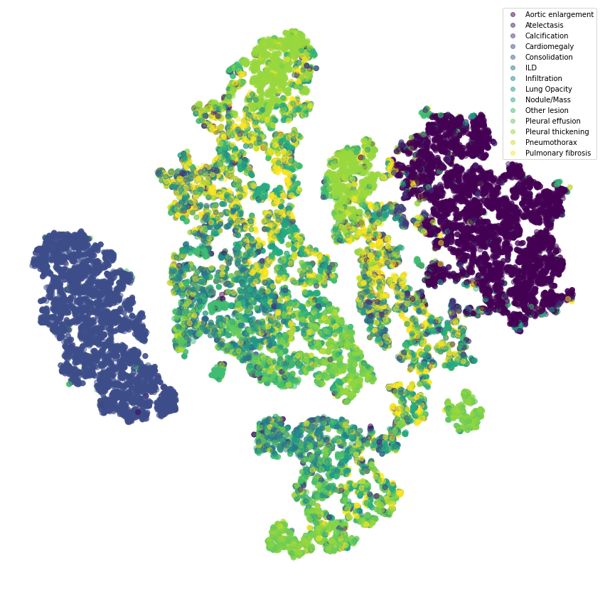
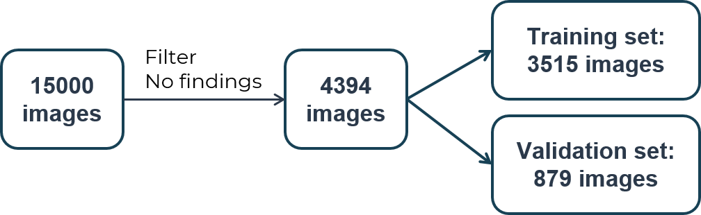

## 1. Thông tin về nguồn dữ liệu

Chúng tôi sử dụng các dữ liệu được tải về và tiền xử lý từ website của cuộc thi [VinBigData Chest X-ray Abnormalities Detection](https://www.kaggle.com/c/vinbigdata-chest-xray-abnormalities-detection). Theo website chính thống của VinBigdata, hình ảnh được thu thập từ bệnh viện Trung ương Quân đội 108 và Bệnh viện Đại học Y Hà Nội, 100% dữ liệu được nặc danh hoá (toàn bộ thông tin định danh người bệnh đã được xoá bỏ hoặc thay thế bởi giá trị ngẫu nhiên) và chỉ giữ lại các thông tin cần thiết, phục vụ việc phân tích và xử lý hình ảnh. Mỗi hình ảnh cuộc thi cung cấp đều được đọc bởi các bác sĩ chẩn đoán hình ảnh đầu ngành tại Việt Nam. Đối với dữ liệu đào tạo, mỗi ca chụp được gán nhãn độc lập bởi 3 bác sĩ. Trong khi đó, đối với dữ liệu đánh giá, mỗi ca chụp được gán nhãn bởi hội đồng gồm 5 bác sĩ.

## 2. Trực quan hoá dữ liệu với t-SNE

## 3. Xoá nhãn No finding

Dữ liệu ban đầu gồm 15000 ảnh, nhưng trong đó có chứa nhiều ảnh với nhãn "No finding", tức là không có bất thường nào trong ảnh. Vì vậy, chúng tôi thực hiện loại bỏ những ảnh không chứa bất thường nào, cuối cùng thu được tập dữ liệu gồm 4394 ảnh. Các nhãn được giữ lại gồm: **Aortic enlargement, Atelectasis, Calcification, Cardiomegaly, Consolidation, .iltration, Lung Opacity, Nodule/Mass, Other lesion, Pleural effusion, Pleural thickening, Pneumothorax, Pulmonary fibrosis**. Tiếp đó, chúng tôi chia tập dữ liệu này thành 2 tập nhỏ là tập huấn luyện (training set) gồm 3515 ảnh và tập giám sát (validation set) gồm 879 ảnh.

