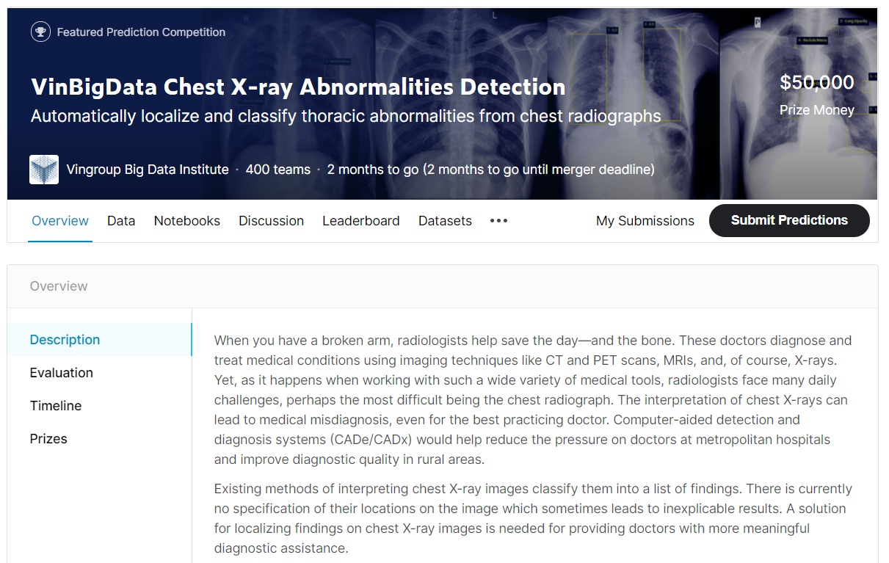

Kỹ thuật chẩn đoán hình ảnh chụp X-quang diễn ra rất phổ biến trong các xét nghiệm y tế tại bệnh viện. Hình ảnh X-quang phổi có giá trị trong việc phát hiện, chẩn đoán bệnh, đánh giá mức độ nặng, đánh giá các biến chứng hô hấp, theo dõi đáp ứng điều trị và chẩn đoán phân biệt. Dựa vào bộ dữ liệu được công bố trong cuộc thi [VinBigData Chest X-ray Abnormalities Detection](https://www.kaggle.com/c/vinbigdata-chest-xray-abnormalities-detection) chúng tôi xây dựng các thuật toán trí tuệ nhân tạo để phát hiện và khoanh vùng 14 loại tổn thương khác nhau trên hình ảnh X-quang phổi.

