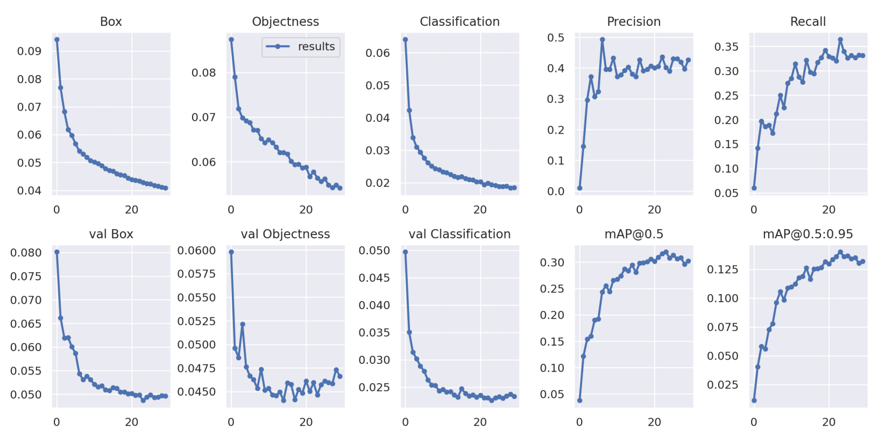
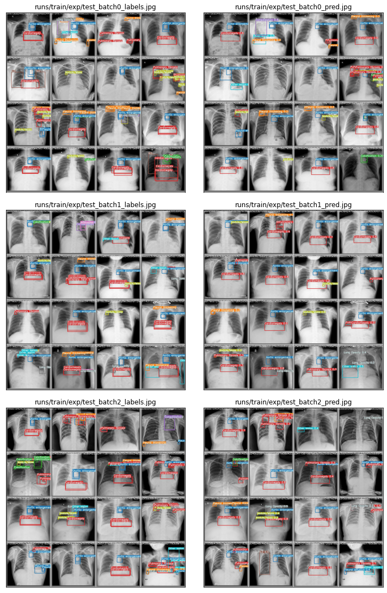

## 1. Mô hình

Mô hình chúng tôi thử nghiệm cho bài toán này là YOLOv5. Dù đang trong quá trình phát triển, tài liệu về mô hình chưa đầy đủ, và cũng chưa có bài báo chính thức nào, nhiều thử nghiệm cho thấy YOLOv5 đạt kết quả rất tốt. Trong repository chứa mã nguồn của YOLOv5 tại [ultralytics/yolov5](https://github.com/ultralytics/yolov5), tác giả đã thực hiện một thử nghiệm để so sánh các phiên bản YOLOv5 với nhau và với EfficientDet, một mạng SOTA cho phát hiện vật.

Chúng tôi lựa chọn mô hình YOLOv5x - mô hình đạt độ chính xác cao nhất để tiến hành huấn luyện cho bài toán này.

## 2. Thử nghiệm

Sau khi huấn luyện 30 epochs trên bộ dữ liệu đã chuẩn bị, mô hình đạt kết quả tốt nhất tại epoch 23 là **mAP@0.5 = 0.320**, **mAP@.5:.95 = 0.140**.

Kết quả chạy thử mô hình với một số ảnh như sau:

