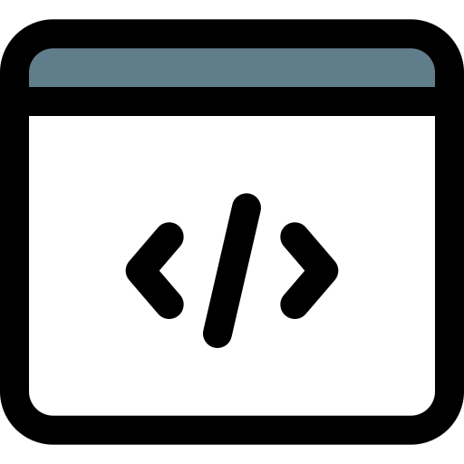

Toàn bộ mã nguồn của dự án **VN AIDr** đều được mở cho cộng đồng. Chúng tôi rất hoan nghênh các đóng góp của các bạn cho mã nguồn, mô hình và các ý kiến liên quan đến y học. Mã nguồn có thể được đóng góp trực tiếp bằng cách tạo pull request tại các repo của dự án. Các ý kiến khác có thể được gửi qua [Trang liên hệ](https://vnopenai.org/contact/).

- Mã nguồn huấn luyện: <https://www.kaggle.com/vietanhdev/vinbigdata-cxr-ad-yolov5-14-class-train?scriptVersionId=52123826>.