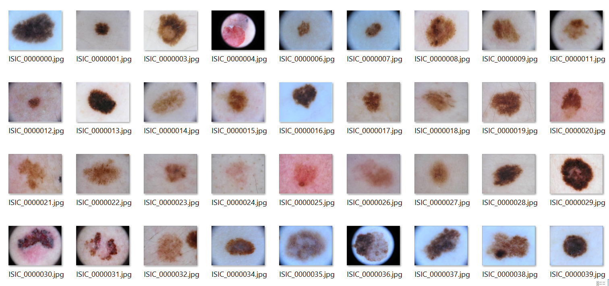

## 1. Giới thiệu bài toán.

Phân đoạn ảnh y tế là vấn đề quan trọng trong các ứng dụng chuẩn đoán lâm sàng. Các ứng dụng của phân đoạn ảnh y tế giúp các bác sĩ tập trung hơn vào vùng bị tổn thương, giúp chuẩn đoán của bác sĩ trở lên dễ dàng hơn, chính xác hơn. Ngoài ra một trong các ứng dụng quan trọng của bài toán này là giúp đưa ra bằng chứng xác thực hơn, đang tin cậy hơn khi các mô hình AI đưa ra quyết định.

Một trong nhưng vấn đề khó của phân đoạn ảnh y tế là không có sẵn lượng dữ liệu đủ lớn, chất lượng tốt và được gán nhãn, lý do là dữ liệu về ảnh y tế là nguồn dữ liệu nhạy cảm, yêu cầu người gán nhãn cần có kiến thức chuyên môn. Dựa trên những lý do đó, nhóm chúng tôi lựa chọn bài toán phân đoạn vùng da bị tổn thương , hỗ trợ trong chuẩn đoạn ảnh y tế - như là một phần trong VN-AIDr.

## 2. Dữ liệu

### 2.1. Chuẩn bị dữ liệu

Như đề cập trước giới hạn về nguồn dữ liệu là một vấn đề khó, cuộc thi [ISIC2018_task1](https://challenge2018.isic-archive.com/) cung cấp một lượng dữ liệu chất lượng đã được gán nhãn bởi các chuyên gia y tế. Tập dữ liệu do ban tổ chức cung cấp bao gồm tập ảnh train-validation-test, nhưng do cuộc thi đã kết thúc nên không thể lấy được tập test của ban tổ chức, chúng tôi quyết định sử dụng tập validation của ban tổ chức làm tập dữ liệu test và tập dữ liệu train của ban tổ chức sẽ chia làm hai để huấn luyện và lựa chọn mô hình.

**Dữ liệu bao gồm:**

* 2051 ảnh huấn luyện 
* 500 ảnh tập giám sát
* 1000 ảnh kiểm định

### 2.2. Tiền xử lý dữ liệu

Với mô hình thử nghiệm khác nhau đều sử dụng chung cách thức xử lý dữ liệu.

Áp dụng các phương pháp làm giàu và chuẩn hóa dữ liệu thông thường:

