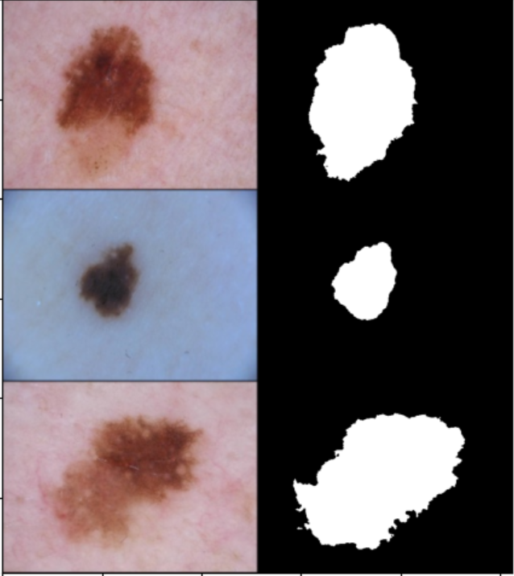

## 1. Mô hình

### 1.1. U-Net

Một trong những mạng phổ biến nhất của bài toán đoạn ảnh là mô hình U-Net, và nhiều biến thể của mô hình U-Net.

Chúng tôi đã thử nghiệm lại mô hình này như những bước tiếp cận ban đầu. cấu trúc mô hình đã được sửa lại cho phù hợp với bài toán, hàm kích hoạt đầu ra là sigmoid cho đầu ra hai lớp.

### 1.2. Double U-Net

Mô hình cải tiến của U-Net, với kiến trúc mạng gồm hai mạng con, gần giống với hai mạng U-Net nối tiếp. đều có dạng encoder - decoder. Ở phần decoder2 có concatenate với skip-connections của decoder 1. Đầu ra của mạng bao gồm đầu ra của 2 mạng con. Trong bài báo gốc, tác giả chỉ ra rằng cả hai đầu ra đều có thể sử dụng để phân vùng ảnh, mạng con thứ 2 có tác dụng như là tinh chỉnh lại đầu ra. Một cải tiến nữa của U-Net là sử dụng ASPP.

## 2. Thử nghiệm và kết quả

Cả 2 mô hình đều sử dụng :

- **Hàm mục tiêu sử dụng:** Dice loss.
- **Độ đo:** Mean intersection of union (Mean IoU).

Thuật toán huấn luyện Adame với tốc độ học $10^{-5}$. Sau 80 epochs với cùng tập dữ liệu và cùng một cách tiền xử lý.

| Mô hình              | U-Net | Double U-Net |
|----------------------|-------|--------------|
| Mean IoU             | 0.79  | 0.82         |

Kết quả cuối cùng mô hình tốt nhất trên tập kiểm thử là IOU = 0.79.

## Tham khảo

[1] Origin paper: [DoubleU-Net: A Deep Convolutional Neural
Network for Medical Image Segmentation](https://arxiv.org/pdf/2006.04868.pdf)

[2] ASPP block :[DeepLab: Semantic Image Segmentation with
Deep Convolutional Nets, Atrous Convolution,
and Fully Connected CRFs](https://arxiv.org/pdf/1606.00915v2.pdf)

[3] [Repository 2020-CBMS-DoubleU-Net](https://github.com/DebeshJha/2020-CBMS-DoubleU-Net)

[4] Data: [ISIC2018_task1 Lesion Boundary Segmentaion ](https://challenge2018.isic-archive.com/)
